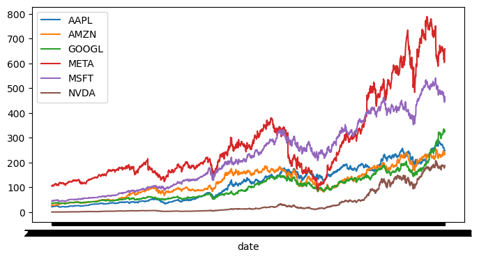
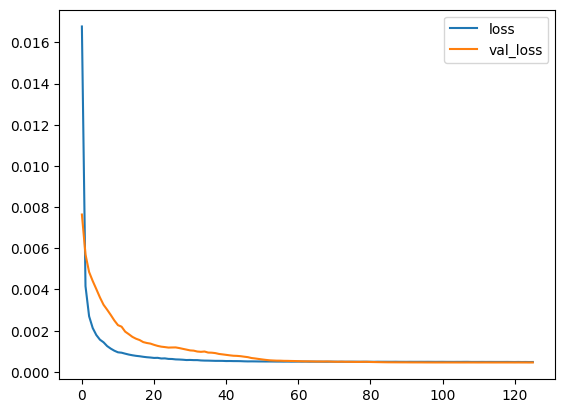
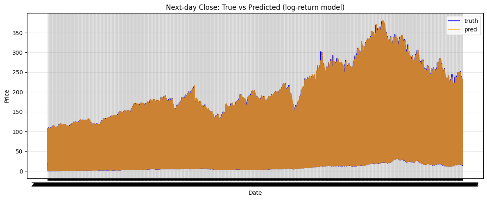

# Multi-Stock LSTM Forecasting

A deep learning project for multi-stock forecasting using LSTM networks, technical indicators, and ticker-aware sequence modeling.

This repository builds a next-step forecasting pipeline on FAANG-style stock market data. The project combines price-based features, technical indicators, and ticker encoding to train an LSTM model that learns temporal patterns across multiple stocks in a single framework.

## Project Overview

The goal of this project is to forecast the next step in stock behavior using historical sequences of market data.

The workflow includes:

- loading multi-stock market data
- using precomputed technical indicators
- encoding ticker identity with one-hot vectors
- standardizing features
- creating rolling time-series windows
- training an LSTM-based predictor
- reconstructing price-level forecasts from predicted log returns

This makes the project more realistic than a single-series notebook because the model has to learn both temporal structure and cross-ticker variation.

## Dataset

The dataset contains six stocks:

- AAPL
- AMZN
- GOOGL
- META
- MSFT
- NVDA

Each ticker has an equal number of records, and the notebook works on a combined dataset spanning multiple years of daily observations.

The available features include:

- Open
- High
- Low
- Close
- Volume
- SMA7
- SMA21
- EMA12
- EMA26
- RSI14
- MACD
- MACDSignal
- BollingerUpper
- BollingerLower
- DailyReturn
- Volatility7d

Ticker identity is added through one-hot encoding so the model can distinguish between different stocks while still training in a shared sequence-learning setup.

## Visualizations

### Multi-stock closing trends

This plot shows how the selected stocks evolve across time and gives a first view of their relative scale, movement patterns, and long-term behavior.



### Training loss

This figure tracks the optimization behavior of the LSTM model during training and helps assess whether the model is learning stably over epochs.



### Forecast performance

This visualization compares predicted values against actual values and is the main qualitative check for model performance on unseen data.



## Problem Formulation

This project explores two forecasting formulations:

### 1. Direct next-step value prediction

The first approach predicts the next value directly from the input sequence.

### 2. Log-return prediction with price reconstruction

The later and more meaningful setup predicts log next return and then reconstructs the next price level using the current close value.

This is a better financial formulation because returns are generally more stable than raw prices, and it connects the model more naturally to market movement rather than absolute scale alone.

## Model Architecture

The forecasting model is a stacked LSTM network followed by dense layers.

Architecture used in the notebook:

- Input sequence length: 128
- Feature dimension: ticker-aware multivariate input
- LSTM(128, return_sequences=True)
- LSTM(64)
- Dense(32, activation="relu")
- Dense(16, activation="relu")
- Dense(1)

Training setup includes:

- Adam optimizer
- learning rate of 1e-4
- mean squared error loss
- early stopping with restored best weights

The sequence windows are created from standardized features before being passed to the network.

## Pipeline

The notebook follows this order:

1. Load the stock dataset.
2. Inspect ticker balance and feature structure.
3. One-hot encode ticker labels.
4. Build the training matrix from price and indicator features.
5. Split data into train and test partitions.
6. Scale the input features.
7. Convert the data into rolling time-series windows.
8. Train the LSTM model.
9. Generate predictions on sequential test windows.
10. Reconstruct next-step price forecasts from predicted log returns.
11. Compare predicted and true trajectories visually and numerically.

## Why this project matters

This project demonstrates more than just model training. It shows how to design an end-to-end time-series forecasting workflow for financial data.

Key engineering ideas covered in the notebook:

- multivariate time-series preprocessing
- ticker-aware learning with one-hot encoding
- sequence generation for recurrent models
- feature scaling for stable optimization
- LSTM-based forecasting
- moving from raw target prediction to return-based prediction
- price reconstruction from transformed targets
- error evaluation with RMSE and MAE
- visual comparison of predicted versus true trajectories

## Repository Structure

```text
.
├── data/
├── images/
├── stock_forecasting
├── README
├── requirements
└── .gitignore
```

## Results and Interpretation

The notebook evaluates predictions after generating rolling sequences from the held-out portion of the dataset.

The project is useful as a practical forecasting pipeline, but the right interpretation is important:

- this is a predictive modeling experiment, not a trading strategy
- low regression error does not automatically imply profitable market decisions
- financial time series are noisy, non-stationary, and difficult to generalize across regimes
- feature design, target formulation, and split strategy matter as much as model depth

The shift toward log-return modeling is an important improvement because it makes the target more aligned with actual market movement and allows reconstruction back to price space for interpretation.

## How to Run

1. Clone the repository.
2. Install the required dependencies:
   ```bash
   pip install -r requirements.txt
   ```
3. Open Jupyter Notebook:
   ```bash
   jupyter notebook
   ```
4. Run the notebook cells in order.

## Future Improvements

Some strong next steps for this project would be:

- evaluating each ticker separately after shared training
- comparing LSTM against GRU and Transformer baselines
- adding directional accuracy metrics
- using walk-forward validation instead of a single split
- building a simple trading simulation layer
- testing feature selection and ablation
- adding attention or hybrid architectures
- predicting multi-step horizons instead of one-step only

## Summary

This repository presents a multi-stock LSTM forecasting pipeline built on technical-indicator-enriched market data.

Its main strength is the complete workflow: structured preprocessing, sequence generation, recurrent modeling, transformed-target prediction, and reconstruction back to interpretable price forecasts.
